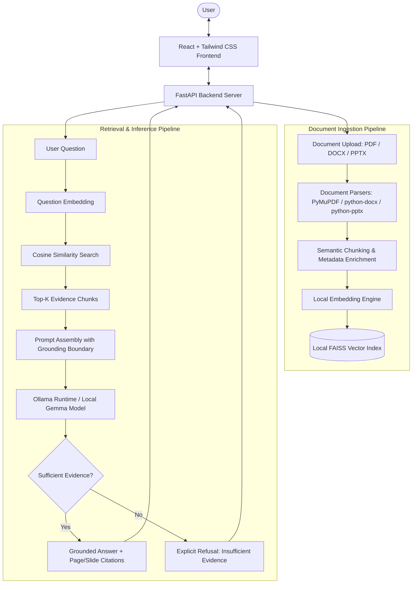

# LocalDoc AI

> **A local-first, privacy-preserving AI document agent and knowledge assistant running entirely on your machine.**

---

## 1. Project Overview

**LocalDoc AI** is an offline-capable, local-first document question-answering and editing assistant developed for a 6-hour solo hackathon. It allows users to ingest local documents in multiple formats (**PDF**, **DOCX**, and **PPTX**), extract their text with page and slide attribution, generate dense semantic embeddings on device, store them in a local vector index, and query them using a local open-weight language model (Gemma via Ollama).

Crucially, LocalDoc AI is designed with an **evidence-first grounding paradigm**: answers are synthesized strictly from retrieved context with explicit page/slide citations, and the system explicitly refuses to answer when sufficient supporting evidence is absent from the indexed documents.

---

## 2. Problem Statement

Modern cloud-based AI services require users to transmit private, proprietary, or sensitive files over the public internet to third-party servers. In many environments—including legal analysis, proprietary engineering, financial auditing, healthcare documentation, and confidential coursework—cloud transmission violates privacy guidelines, organizational policies, or regulatory compliance.

Furthermore:
- **General-purpose LLMs lack access to private local context:** They cannot reliably reason over local, non-public documents without ingestion.
- **Cloud dependency creates vulnerability:** Network latency, outages, API rate limits, and subscription costs impede seamless productivity.
- **Unconstrained generation causes hallucinations:** Typical chat applications guess or invent plausible-sounding answers when private documents do not contain the answer.

There is a critical need for an AI assistant that runs 100% locally, guarantees complete document confidentiality, enforces strict citation grounding, and operates seamlessly even when offline.

---

## 3. Solution

LocalDoc AI addresses these challenges through a modular, local-first architecture:
- **Zero Cloud Leakage:** Ingestion, parsing, embedding generation, vector similarity indexing, and LLM inference execute entirely on `localhost`.
- **Structured Multi-Format Extraction:** Dedicated parsers extract text while preserving structural boundaries (page numbers for PDFs, slide numbers for PPTXs, sections/paragraphs for DOCXs).
- **Dense Local Retrieval:** Semantic chunks are indexed in a local FAISS index, ensuring fast vector search without external vector databases.
- **Strict Grounding & Hallucination Mitigation:** The prompt boundary instructs the local model to only generate statements backed by retrieved chunks and to refuse unsupported queries.
- **Controlled Document Modification:** Instead of risky arbitrary code execution, natural-language editing instructions are translated into structured, schema-validated JSON operations and applied using deterministic Python handlers.

---

## 4. Key Features

- **Local Multi-Format Processing:** Parses `.pdf` (PyMuPDF), `.docx` (python-docx), and `.pptx` (python-pptx) files locally.
- **Semantic Chunking:** Context-aware text chunking that retains document source metadata, page numbers, and section headers.
- **Local Dense Embeddings:** Generates vector representations locally via Sentence-Transformers without cloud API calls.
- **Local Vector Search:** Fast cosine similarity search powered by FAISS.
- **Local Open-Weight LLM:** Runs open-weight models (Gemma family) locally using the Ollama runtime.
- **Evidence-Grounded Answers:** Responses cite exact document names, page numbers, and slide locations.
- **Explicit "Insufficient Evidence" Refusal:** Directly admits when documents do not contain the facts requested rather than hallucinating.
- **Offline Resilience:** Functions completely without an internet connection once models and dependencies are downloaded.
- **Controlled Document Editing (Optional/Bonus):** Safely translates user requests (e.g., *"Change 75% attendance requirement to 80%"*) into deterministic document modifications without running arbitrary generated code.

---

## 5. Why This Is Different

LocalDoc AI is **not** simply another generic "chat with your PDF" wrapper:

| Differentiator | Generic Cloud Wrappers | LocalDoc AI |
|---|---|---|
| **Data Privacy** | Sends files and questions to external cloud APIs | 100% of data and embeddings remain on the local machine |
| **Offline Operation** | Requires continuous internet access | Fully functional offline after initial setup |
| **Model Transparency** | Closed-source, remote proprietary APIs | Open-weight model (Gemma) running via local Ollama runtime |
| **Grounding Discipline** | Prone to ungrounded speculation when facts are missing | Explicit refusal policy if similarity thresholds are not met |
| **Citation Granularity** | Often vague or absent | Direct attribution to specific pages, slides, or sections |
| **Document Modification** | Either unsupported or attempts unsafe code execution | Declarative, schema-validated operations executed deterministically |

*Note: LocalDoc AI does not claim superiority over frontier cloud models in broad general knowledge reasoning; rather, it offers a specialized, privacy-preserving, and verifiable architecture tailored specifically for private documents.*

---

## 6. Architecture



---

## 7. How It Works

The complete lifecycle operates through ten transparent steps:

1. **Upload:** User provides a `.pdf`, `.docx`, or `.pptx` file via the React UI or REST endpoint.
2. **Text Extraction:** Native format engines (`fitz`, `python-docx`, `python-pptx`) extract raw text while capturing structural landmarks (page numbers, headings, slide numbers).
3. **Chunking:** Text is partitioned into semantically coherent chunks (approx. 400–600 tokens) with sliding overlap to preserve contextual continuity.
4. **Embedding Generation:** Each chunk is converted into a dense vector embedding using a local Sentence-Transformers model.
5. **Vector Storage:** Embeddings and chunk metadata are stored in a local FAISS index on disk.
6. **Question Embedding:** When a user poses a question, the query is encoded using the same local embedding model.
7. **Similarity Search:** FAISS computes cosine similarity against all stored document chunk vectors to find the nearest neighbors.
8. **Context Retrieval:** The top-$k$ most relevant chunks exceeding the similarity threshold are extracted alongside their source references.
9. **Local LLM Generation:** The context and question are formatted into a grounded prompt and passed to the local Gemma model via Ollama.
10. **Evidence Display:** The frontend renders the response, highlighting corresponding source documents, page numbers, and exact excerpts. If no chunk meets the confidence threshold, an explicit refusal message is displayed.

---

## 8. Offline Architecture

LocalDoc AI is designed with an explicit offline-first boundary:

### Local Components (Offline)
- **Document Processing:** Local Python libraries running directly on host CPU.
- **Embedding Generation:** Model weights cached in local cache directories; runs on host CPU/GPU.
- **Vector Search:** FAISS index operates entirely in host memory and local disk.
- **LLM Inference:** Ollama server communicates over localhost socket (`127.0.0.1:11434`).
- **Web Interface:** Local development/production server serving assets to local browser.

### When Internet Access is Required
- Initial downloading of Python packages (`pip`) and Node dependencies (`npm`).
- Initial download of the Ollama executable and pulling of target model weights (`ollama pull ...`).

> **Offline Status Disclaimer:** *The architecture is strictly designed for full offline execution once initial dependencies are cached. Offline functionality will be formally marked as verified in Section 17 following controlled network-disabled integration testing.*

---

## 9. Technology Stack

| Technology | Purpose | Why It Is Used | Official Resource |
|---|---|---|---|
| **React** | Frontend UI Framework | Component-driven, responsive UI for document management and chat | [https://react.dev](https://react.dev) |
| **Tailwind CSS** | Frontend Styling | Rapid utility-first styling for clean modern user experience | [https://tailwindcss.com](https://tailwindcss.com) |
| **FastAPI** | Backend API Framework | High performance, native async support, automatic OpenAPI docs | [https://fastapi.tiangolo.com](https://fastapi.tiangolo.com) |
| **Uvicorn** | ASGI Web Server | Production-grade ASGI server to run FastAPI locally | [https://www.uvicorn.org](https://www.uvicorn.org) |
| **PyMuPDF (`fitz`)** | PDF Text Extraction | Exceptionally fast, low-overhead PDF parsing with page-level tracking | [https://pymupdf.readthedocs.io](https://pymupdf.readthedocs.io) |
| **python-docx** | Word Document Processing | Standard Python library for inspecting and modifying `.docx` files | [https://python-docx.readthedocs.io](https://python-docx.readthedocs.io) |
| **python-pptx** | PowerPoint Processing | Extracts slide text and structures from `.pptx` presentations | [https://python-pptx.readthedocs.io](https://python-pptx.readthedocs.io) |
| **FAISS (`faiss-cpu`)** | Vector Index & Retrieval | Highly optimized dense vector search engine developed by Meta Research | [https://github.com/facebookresearch/faiss](https://github.com/facebookresearch/faiss) |
| **Sentence-Transformers** | Local Dense Embeddings | Efficient local embedding generation without cloud dependencies | [https://sbert.net](https://sbert.net) |
| **Ollama** | Local LLM Runtime | Lightweight local runner for quantized open-weight language models | [https://ollama.com](https://ollama.com) |
| **Pydantic** | Schema Validation | Type-safe request/response validation and structured edit validation | [https://docs.pydantic.dev](https://docs.pydantic.dev) |

---

## 10. AI Models

The project targets the open-weight **Gemma** model family running via Ollama. Exact specifications are tracked below:

| Attribute | Verified Specification / Current Status |
|---|---|
| **Target Model Family** | Google Gemma |
| **Target Runtime** | Ollama (`http://localhost:11434`) |
| **Target Model Candidate** | Gemma 4 / Gemma 2 local quantized variant (e.g., `gemma2:2b`, `gemma2:9b`, or newest Gemma release) |
| **Quantization** | 4-bit / Q4_K_M (recommended for consumer hardware balance) |
| **Model Source** | Official Google Gemma distribution via Ollama library |
| **Model License** | Gemma Terms of Use |
| **Model Size** | Variable depending on benchmark: ~1.6 GB (2B Q4) to ~5.5 GB (9B Q4) |
| **Hardware Requirements** | *Pending hardware benchmark on target machine* |

> *Notice: In accordance with project integrity standards, exact benchmark statistics, inference tokens-per-second, and model variant selections will be updated only after empirical benchmarking on the host system.*

---

## 11. Resources & References

### AI Models
- **Google Gemma**: Official model page at [https://ai.google.dev/gemma](https://ai.google.dev/gemma). Governed by the Gemma Terms of Use. Used for local text inference and structured operation synthesis.
- **all-MiniLM-L6-v2**: Official HuggingFace repository at [https://huggingface.co/sentence-transformers/all-MiniLM-L6-v2](https://huggingface.co/sentence-transformers/all-MiniLM-L6-v2). Apache 2.0 license. Used for producing 384-dimensional dense semantic vectors.

### Libraries
- **PyMuPDF (`fitz`)**: Documentation at [https://pymupdf.readthedocs.io](https://pymupdf.readthedocs.io). Fast page-accurate PDF text extraction.
- **python-docx**: Documentation at [https://python-docx.readthedocs.io](https://python-docx.readthedocs.io). Word document reading and modification.
- **python-pptx**: Documentation at [https://python-pptx.readthedocs.io](https://python-pptx.readthedocs.io). PowerPoint slide text extraction.
- **FAISS (`faiss-cpu`)**: Documentation at [https://github.com/facebookresearch/faiss](https://github.com/facebookresearch/faiss). Dense vector similarity search.
- **Sentence-Transformers**: Documentation at [https://sbert.net](https://sbert.net). Dense text embedding framework.
- **Pydantic**: Documentation at [https://docs.pydantic.dev](https://docs.pydantic.dev). Schema validation and settings management.

### Frameworks
- **FastAPI**: Documentation at [https://fastapi.tiangolo.com](https://fastapi.tiangolo.com). Async REST API server.
- **Uvicorn**: Documentation at [https://www.uvicorn.org](https://www.uvicorn.org). ASGI server.
- **React**: Documentation at [https://react.dev](https://react.dev). Web UI framework.
- **Tailwind CSS**: Documentation at [https://tailwindcss.com](https://tailwindcss.com). Utility styling.

### Tools
- **Ollama**: Documentation at [https://ollama.com](https://ollama.com). Local model server.
- **Git**: Documentation at [https://git-scm.com](https://git-scm.com). Distributed version control.

### Research / Technical References
- Lewis et al., *"Retrieval-Augmented Generation for Knowledge-Intensive NLP Tasks"* (NeurIPS 2020).
- Johnson et al., *"Billion-scale similarity search with GPUs"* (Meta AI Research / FAISS).

### AI Coding Tools
- **Gemini CLI**: Used as an interactive developer assistant for repository initialization, architecture planning, `.gitignore` structuring, and documentation drafting.

---

## 12. AI Assistance Disclosure

In alignment with transparent hackathon standards:
- **Architecture & Planning:** Gemini CLI assisted with drafting the architectural roadmap, structuring pipeline boundaries, designing the initial directory layout, and creating comprehensive documentation.
- **Code & Test Implementation:** The implementation of document parsers, FAISS indexing, API routing, and frontend components will be authored collaboratively with AI assistance and validated via empirical testing.
- **No False Claims:** AI did not independently generate the entire project without human oversight. All designs, tool selections, constraints, and implementations are reviewed and verified directly by the author.

---

## 13. Installation

### Prerequisites
1. **Python 3.10+**
2. **Node.js 18+** and **npm**
3. **Ollama** installed and running on your system ([Download Ollama](https://ollama.com))

### Setup Steps
```bash
# 1. Clone the repository
git clone https://github.com/Udaysk9999/hacktoberfest.git
cd hacktoberfest

# 2. Set up Backend Python Virtual Environment
cd backend
python -m venv .venv

# On Windows:
.venv\Scripts\activate
# On Linux/macOS:
# source .venv/bin/activate

# Install backend dependencies (as specified in backend requirements)
pip install --upgrade pip

# 3. Set up Frontend (when initialized)
cd ../frontend
npm install

# 4. Pull target Ollama Model (e.g., gemma2:2b or selected benchmarked variant)
ollama pull gemma2:2b
```

---

## 14. Running Locally

### Step 1: Start Ollama Runtime
Ensure the Ollama background daemon is running:
```bash
ollama serve
```

### Step 2: Start Backend Server
From the `backend` directory with the virtual environment activated:
```bash
uvicorn app.main:app --host 127.0.0.1 --port 8000 --reload
```
The FastAPI interactive documentation will be accessible at: `http://127.0.0.1:8000/docs`

### Step 3: Start Frontend Development Server
From the `frontend` directory:
```bash
npm run dev
```
The application interface will be accessible at: `http://localhost:5173`

---

## 15. Environment Variables

Configuration parameters are loaded from a `.env` file in the root or `backend` folder. A template is provided in `.env.example`:

```bash
# Server Settings
HOST=127.0.0.1
PORT=8000
ENVIRONMENT=development

# Ollama Connection
OLLAMA_BASE_URL=http://localhost:11434
OLLAMA_MODEL=gemma4

# Embeddings
EMBEDDING_MODEL_NAME=sentence-transformers/all-MiniLM-L6-v2

# Storage Directories
UPLOAD_DIR=./data/uploads
VECTOR_STORE_DIR=./data/vector_store
```

*Never commit `.env` or files containing secret credentials to Git.*

---

## 16. Hardware Requirements

LocalDoc AI is designed to run on consumer hardware by leveraging efficient embedding models and quantized local LLMs:

| Resource | Minimum (Estimated) | Recommended (Estimated) |
|---|---|---|
| **CPU** | 4 cores (modern x86_64 / ARM64) | 8 cores or higher |
| **System RAM** | 8 GB | 16 GB+ |
| **GPU / VRAM** | CPU execution supported (slow) | 4 GB+ dedicated VRAM (NVIDIA CUDA / Apple Metal) |
| **Disk Space** | 10 GB free (models + packages) | 25 GB free SSD storage |
| **Model Footprint** | ~2 GB (2B Q4 model + embeddings) | ~6 GB (9B Q4 model + embeddings) |

*Hardware benchmark figures will be measured and documented after live local execution testing.*

---

## 17. Project Status

- [x] Project initialized & Git configured
- [x] Architecture design & documentation completed
- [x] `.gitignore` and security rules established
- [ ] Backend API skeleton (FastAPI)
- [ ] Document upload & sandboxing
- [ ] PDF extraction (PyMuPDF)
- [ ] DOCX extraction (python-docx)
- [ ] PPTX extraction (python-pptx)
- [ ] Semantic chunking engine
- [ ] Local vector embeddings (Sentence-Transformers)
- [ ] Local vector search (FAISS)
- [ ] Ollama local Gemma integration
- [ ] Evidence citation & strict refusal handling
- [ ] Frontend user interface (React + Tailwind CSS)
- [ ] Controlled document modification engine
- [ ] Offline operation verification
- [ ] Performance benchmarking & evaluation

---

## 18. Evaluation

System efficacy will be quantitatively evaluated using the following benchmark dimensions:

1. **Retrieval Precision & Recall:** Measure if the top-$k$ retrieved chunks contain the ground-truth answer snippet across a test set of synthetic and real documents.
2. **Grounding & Citation Accuracy:** Verification that the generated answer cites the exact document and page/slide where the factual statement originated.
3. **Refusal Accuracy:** Test queries designed to be unanswerable from the provided documents to ensure the model issues an explicit refusal rather than hallucinating.
4. **Latency:** Measurement of ingestion time, chunk embedding duration, vector query latency, and LLM time-to-first-token (TTFT).
5. **Memory Footprint:** Resident RAM and GPU VRAM consumption during peak ingestion and inference workloads.

*All evaluation metrics will be published with verifiable reproduction instructions once test suites are completed.*

---

## 19. Security & Privacy

- **Strict Local Data Boundary:** No uploaded documents, extracted paragraphs, vector coordinates, or queries are ever sent outside `localhost`.
- **Exclusion of Secrets & User Documents:** Rigorous `.gitignore` rules prevent accidentally committing `.env`, user uploads, cache files, vector indexes, or model weights.
- **Protection Against Arbitrary Code Execution:** When modifying documents (e.g., updating a policy number), the system forbids the LLM from generating or executing Python/shell code. Instead, the model outputs a declarative JSON schema that is validated by Pydantic and executed by hardcoded, deterministic Python routines.
- **Path Sanitization:** File uploads are assigned randomized identifiers and confined to a dedicated data directory to prevent path traversal attacks.

---

## 20. Limitations

- **Compute Sensitivity:** Local LLM inference speed depends directly on the host machine's hardware (GPU vs. CPU).
- **Complex Scanned PDF Layouts:** Initial ingestion focuses on digital text extraction; scanned image-only PDFs require an OCR pre-processor not included in the basic 6-hour hackathon scope.
- **Context Window Constraints:** Local models operate within finite context windows (typically 4k–8k tokens); large document synthesis relies on top-$k$ retrieval chunking rather than full-document ingestion into the context window.
- **Edit Scope:** The bonus document editing feature is restricted to supported atomic operations (string replacement, specific table updates) and cannot restructure entire document layouts.

---

## 21. Future Improvements

- Integrated local OCR (Tesseract / EasyOCR) for scanned PDFs.
- Cross-document comparative synthesis and multi-document chat sessions.
- Interactive side-by-side PDF viewer highlighting retrieved bounding boxes in the user interface.
- Support for structured document diffs before committing document modifications.
- Audio transcription and audio document indexing via local Whisper.

---

## 22. Hackathon Information

- **Event:** Hacktoberfest 2026 Hackathon
- **Type:** Solo Project
- **Focus:** Open-Source AI, Local-First Architecture & Privacy
- **GitHub Repository:** [https://github.com/Udaysk9999/hacktoberfest](https://github.com/Udaysk9999/hacktoberfest)

---

## 23. License

This project is planned for open-source distribution under a standard permissive license (such as the **MIT License**). The official `LICENSE` file will be finalized upon explicit user selection.
