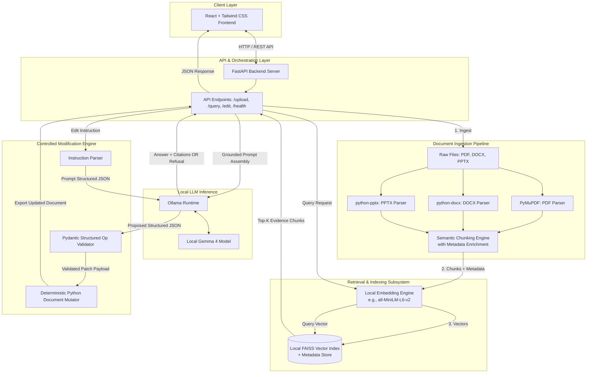

# LocalDoc AI - Architecture Documentation

## 1. Overview & Architectural Philosophy

**LocalDoc AI** is designed from the ground up as a **local-first, privacy-preserving, offline-capable document intelligence agent**. Built for a 6-hour hackathon, its architecture balances rapid implementation with rigorous security, deterministic execution, and hallucination resistance.

### Core Principles
1. **Local-First & Offline Resilience**: No document text, embeddings, or queries leave the host machine. All processing happens via local runtimes (FastAPI, FAISS, Sentence Transformers, and Ollama).
2. **Evidence-Grounded Retrieval**: Responses must cite exact source documents and page/slide locations.
3. **Explicit Refusal**: If the vector index cannot find relevant chunks matching the query threshold, the system explicitly refuses to answer rather than guessing.
4. **Deterministic Document Operations**: Document modification requests are translated into schema-validated JSON operations executed by deterministic Python handlers—never arbitrary code execution.

---

## 2. System Architecture Diagram



---

## 3. Subsystem Breakdown

### 3.1 Document Ingestion & Extraction Engine
- **PyMuPDF (`fitz`)**: Handles PDF files, extracting text block-by-block while recording exact zero-indexed and one-indexed page numbers.
- **`python-docx`**: Parses Word documents, inspecting paragraphs, tables, and section hierarchies.
- **`python-pptx`**: Processes PowerPoint slides, extracting text frames and shape text mapped to specific slide numbers.
- **Chunking Strategy**:
  - Target chunk size: 400–600 tokens (approx. 1,500 characters) with 10–15% overlap.
  - Chunk metadata payload:
    ```json
    {
      "chunk_id": "doc123_p3_c1",
      "document_name": "quarterly_report.pdf",
      "document_type": "pdf",
      "page_or_slide": 3,
      "section_header": "Financial Highlights",
      "char_start": 4120,
      "char_end": 5600
    }
    ```

### 3.2 Embedding & Vector Retrieval Engine
- **Embedding Generation**: Local HuggingFace/Sentence-Transformers model (e.g. `sentence-transformers/all-MiniLM-L6-v2` generating 384-dimensional dense vectors).
- **Index Management**: FAISS (`IndexFlatIP` with normalized vectors for cosine similarity or `IndexFlatL2`).
- **Retrieval Logic**:
  - Cosine similarity search retrieving top-$k$ nearest chunks (default: $k=4$).
  - Similarity threshold gate: Chunks scoring below an empirical minimum similarity score are pruned. If no chunks exceed the cutoff, retrieval triggers the refusal path immediately.

### 3.3 Prompt Grounding & Local LLM Runtime
- **Runtime**: Ollama instance running locally on `localhost:11434`.
- **Target Model**: Gemma 4 (quantized local variant matched to host hardware).
- **Prompt Structure**:
  - System prompt enforcing strict grounding:
    - Only answer using the provided numbered evidence excerpts.
    - Reference sources explicitly in the format `[Source: document_name, Page: X]`.
    - If the context does not contain the answer, reply with: `"Insufficient evidence in provided documents to answer this question."`
    - Prohibit extrapolations and ungrounded speculation.

### 3.4 Controlled Document Modification Engine (Bonus Feature)
To protect document integrity and guarantee execution safety:
1. **Natural Language Translation**: The user submits an instruction (e.g., *"Change attendance policy from 75% to 80%"*).
2. **Schema-Constrained LLM Output**: The LLM is prompted with strict JSON schema definitions for supported operations:
   - `REPLACE_TEXT`: Find target string within target section and replace with new string.
   - `UPDATE_TABLE_CELL`: Locate row/column header and update cell content.
   - `INSERT_PARAGRAPH`: Add paragraph under a specific section heading.
3. **Validation**: Pydantic validates the operation type, target strings, and parameters.
4. **Deterministic Execution**: A dedicated Python handler opens the file via `python-docx` or `python-pptx`, executes the modification, and writes a new revision.
5. **No Arbitrary Code Execution**: The LLM never writes executable code (no `eval`, `exec`, or shell processes).

---

## 4. Security & Privacy Model

| Vector | Defense Mechanism |
|---|---|
| **Data Leakage** | All computation runs locally (`127.0.0.1`). No cloud APIs or telemetry are configured. |
| **Model Injections** | Strict separation of user instructions and retrieved context within system prompt delimiters. |
| **Code Execution** | LLM outputs are treated as untrusted data; only discrete declarative operations are accepted and validated. |
| **File Traversal** | Document uploads and exports are strictly constrained to a sandboxed data directory with sanitized UUID-based paths. |
| **Secret Management** | No remote API keys are required for offline operation. Local environment settings are tracked in `.env.example`. |

---

## 5. Offline Operation Boundaries

```
[Online Phase: Initial Setup Only]
  ├── pip install -r requirements.txt
  ├── npm install
  └── ollama pull <model-tag>

[Offline Boundary: Active Runtime]
  ├── Document Upload ──────> Local Disk Sandboxed Storage
  ├── Document Parsing ─────> Local Python Ingestion
  ├── Chunk Embedding ──────> Local Sentence-Transformers
  ├── Indexing & Search ────> Local FAISS Index
  ├── LLM Inference ────────> Localhost Ollama Runtime
  └── UI Presentation ──────> Local Browser Session
```

Once dependencies and model weights are cached on the machine, LocalDoc AI operates without an active internet connection.
